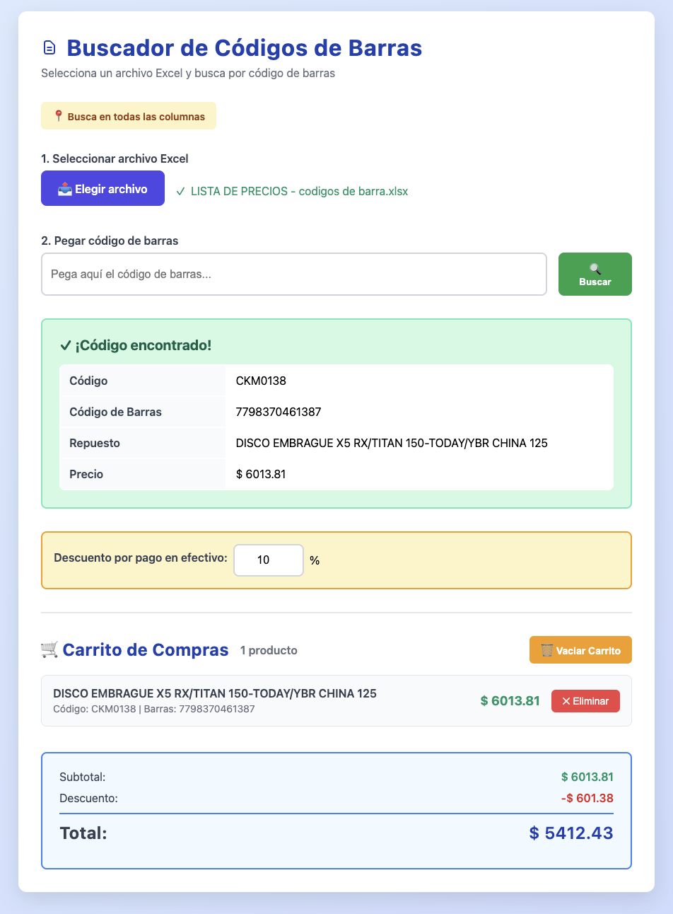

# Sistema POS - Buscador de Códigos de Barras

Aplicación web de punto de venta (POS) para buscar códigos de barras en archivos Excel y gestionar carritos de compra. Permite cargar un archivo Excel, escanear códigos de barras y calcular totales automáticamente con descuentos por pago en efectivo.



## Características

### Búsqueda y Productos
- 📤 **Carga de archivos Excel**: Soporta archivos `.xlsx` y `.xls`
- 🔍 **Búsqueda inteligente**: Busca el código de barras en todas las columnas del archivo
- ⚡ **Búsqueda parcial**: Encuentra coincidencias incluso si el código está contenido dentro de otro valor
- 📊 **Visualización de resultados**: Muestra información detallada del repuesto encontrado:
  - Código
  - Código de Barras
  - Nombre del Repuesto
  - Precio

### Sistema de Carrito
- 🔍 **Búsqueda separada**: Busca información de repuestos sin agregar automáticamente al carrito
- ➕ **Agregar productos manualmente**: Botón "Agregar al Carrito" para agregar productos explícitamente
- ➖ **Eliminar productos**: Botón para eliminar productos individuales del carrito
- 🗑️ **Vaciar carrito**: Botón para limpiar todos los productos de una vez
- 📈 **Contador de productos**: Muestra la cantidad total de productos en el carrito

### Cálculos y Descuentos
- 💰 **Cálculo automático**: Subtotal calculado automáticamente al agregar productos
- 💵 **Descuento por pago en efectivo**: Campo configurable para aplicar descuentos porcentuales
- 📊 **Total con descuento**: Cálculo automático del total final aplicando el descuento
- 🔢 **Visualización de desglose**: Muestra subtotal, descuento y total final

### Interfaz
- 🎨 **Diseño moderno**: Interfaz limpia y responsiva con gradientes y animaciones
- ⚡ **Flujo optimizado**: El campo de código de barras se limpia automáticamente después de agregar al carrito
- 👁️ **Descuento siempre visible**: El campo de descuento está siempre accesible para configuración rápida
- 🔄 **Acciones separadas**: Búsqueda e información separadas de la acción de agregar al carrito

## Cómo usar

### Configuración inicial
1. **Cargar archivo Excel**: Haz clic en "Elegir archivo" y selecciona tu archivo Excel
2. **Configurar descuento** (opcional): Establece el porcentaje de descuento por pago en efectivo

### Proceso de venta

#### Buscar información de repuestos
1. **Escanear código de barras**: Pega o escribe el código de barras en el campo de búsqueda
2. **Buscar**: Haz clic en el botón "Buscar" o presiona Enter
3. **Ver información**: Se muestra la información del repuesto encontrado (Código, Código de Barras, Nombre, Precio)
4. **Decidir**: Revisa la información antes de agregar al carrito

#### Agregar productos al carrito
1. **Agregar al carrito**: Haz clic en el botón "🛒 Agregar al Carrito" en los resultados de búsqueda
2. **Producto agregado**: El producto se agrega al carrito y el campo de código se limpia automáticamente
3. **Ver totales**: El carrito muestra:
   - Lista de productos agregados
   - Subtotal
   - Descuento aplicado
   - Total final

### Gestión del carrito
- **Eliminar producto**: Haz clic en "✕ Eliminar" junto a cualquier producto
- **Vaciar carrito**: Haz clic en "🗑️ Vaciar Carrito" para limpiar todos los productos
- **Ajustar descuento**: Cambia el porcentaje de descuento en cualquier momento y el total se actualiza automáticamente

## Requisitos

- Navegador web moderno (Chrome, Firefox, Safari, Edge)
- Archivo Excel con formato válido (.xlsx o .xls)

## Tecnologías utilizadas

- HTML5
- CSS3
- JavaScript (Vanilla)
- [SheetJS (xlsx.js)](https://sheetjs.com/) - Biblioteca para leer archivos Excel

## Estructura del proyecto

```
app-repuestos-codigo-barra/
├── index.html          # Aplicación completa (HTML, CSS y JavaScript)
├── README.md          # Este archivo
└── images/            # Imágenes del proyecto (opcional)
    └── screenshot.png # Captura de pantalla de la aplicación
```

## Notas técnicas

### Búsqueda
- La aplicación busca en todas las columnas del archivo Excel
- La búsqueda es parcial (no requiere coincidencia exacta)
- Los espacios en blanco se eliminan automáticamente durante la búsqueda
- La aplicación procesa solo la primera hoja del archivo Excel

### Seguridad y privacidad
- Los datos se procesan completamente en el cliente (no se envían a ningún servidor)
- No se almacenan datos en el navegador (el carrito se pierde al recargar la página)

### Funcionalidades del carrito
- Los productos se identifican por un ID único generado al agregarlos
- El descuento se aplica sobre el subtotal de todos los productos
- El cálculo del total se actualiza en tiempo real al modificar el descuento o el carrito
- La búsqueda y visualización de información es independiente del carrito (no se agregan productos automáticamente)
- Puedes buscar múltiples códigos sin agregar al carrito hasta que decidas hacerlo explícitamente

## Formato esperado del Excel

El archivo Excel debe tener una estructura similar a:

| Código | Código de Barras | Repuesto | ... | Precio |
|--------|------------------|----------|-----|--------|
| 001    | 1234567890123    | Filtro   | ... | 25.50  |
| 002    | 9876543210987    | Aceite   | ... | 15.75  |

La aplicación mostrará las columnas en las posiciones 0, 1, 2 y la última columna como: Código, Código de Barras, Repuesto y Precio respectivamente.
